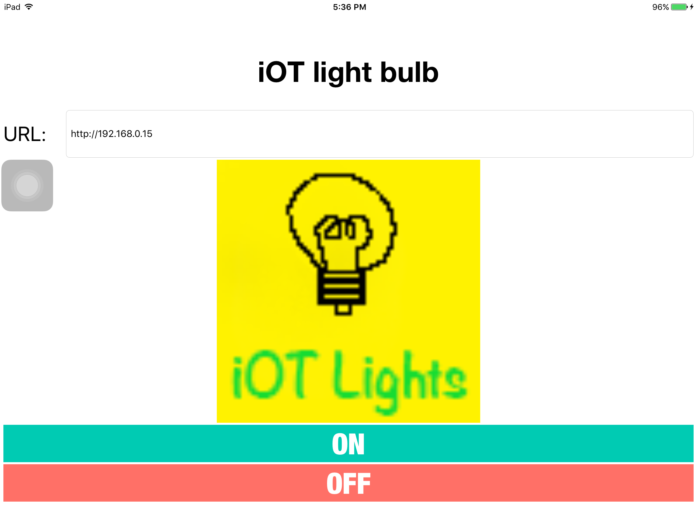

 
# iOT light bulb

* A lightbulb that are able to control using iOS application or web (DONE)
* current stage planning to make localhost first
* sending get request to control the bulb

**_Detailed guide coming soon_**

## Materials
* Light bulb (4.5V)
* nodeMCU
* USB Cable

## Tools
* Version control: Git
* Text editor:
	* NodeMCU: Arduino IDE
	* iOS App: Xcode
	* website: Atom / Sublime Text
	* iOT platform: ThingSpeak (if not localhost)

## Done
* Website that is responsive
* iOS App 

## To Do
* create thingspeak API to control lights via internet
* add transistor to increases bulb brightness
* add external power source instead of using NODEMCU's voltage source (3.3V)
* 

## LICENSE
MIT License. Refer to license.txt

## Contributors
[superoo7](http://superoo7.com)

